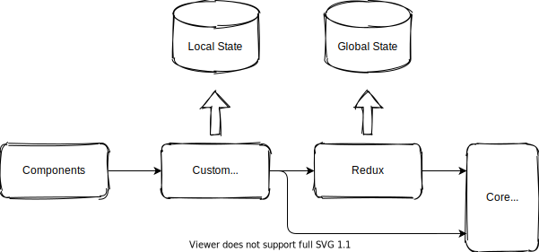

<p align="center">
  <a href="https://plangoab.snamiki1212.vercel.app">
	  
  </a>
  <a href="https://github.com/snamiki1212/plangoab/blob/master/LICENSE.md">
    
  </a>
</p>

# Plangoab

<b><a href="https://plangoab.snamiki1212.vercel.app">Plangoab</a></b> is a online web calendar for a person going abroad.

(Plangoab stands for '<b>plan</b> to <b>go ab</b>road')

### Features

- 📝 Customize your schedule
- ⚙️ Generate plans with many options
- 💁‍♂️ Share a schedule(TODO: Up comming)
- 💻 Save plans on local automatically

### Demo

<table align="center">
  <tr align="center">
    <td>
      <span>📝 Customize your plan</span>
    </td>
    <td>
      <span>⚙️ Generate Plan</span>
    </td>
  </tr>
  <tr align="center">
    <td>
      <a href="https://plangoab.snamiki1212.vercel.app">
        
      </a>
    </td>
    <td>
      <a href="https://plangoab.snamiki1212.vercel.app">
        
      </a>
    </td>
  </tr>
</table>

[👉👉 Try Now](https://plangoab.snamiki1212.vercel.app)

## Why I create

Because I have wanted this app when I make a plan to go to Canada and then to find jobs.

If you want to go abroad to find jobs, you should think about many topics when you make plans.

- When is the deadline to go to Canada with Working Holiday Visa?
- How long can/should you stay in Canada?
- Some schools have different start and term period.
- etc...

Actually, in my case, I handwrote some plans but I made some mistakes to calculate a Visa and my ages. Fortunatelly, I realized it but I almost ruined my career. (Sorry, handwrite is Japanese!)

<table>
  <tr>
    <td>
      
    </td>
    <td>
      
    </td>
  </tr>
</table>

I believe this app would help people who want to plan to go abroad, especially to find job seriously.

I pursued to design this app about data models and workflow that has the capability of handling for people who are from all countries and who want to go all countries.

## Architecture

Here is managed [issues](https://github.com/snamiki1212/plangoab/issues/11).

### Component and logic dependency Flow



### Deps graph

TODO: inplement in CI and automatically save this doc in /doc dir

```zsh
# Build dot file
$ yarn graph:dot

# Build svg file from dot file
$ brwe install graphviz # prerequirements
$ yarn graph:svg
```

### Development Principles

- No Class, but Function
- Atomic Design
- Prefer explainable code
- Never use `this` and `prototype`
- Use function component with general define syntax because of nameful // TODO: create eslint rule

### Tech Stack

- App
  - React
  - Redux (Redux Toolkit)
  - FullCalendar
  - [CSS] styled-components
  - [UI] Material-UI
  - [form] React-Hook-Form
- CI/CD
  - Github Actions
  - GitHub Pages

### Color Pallete

TODO:

## Install

```zsh
$ git clone <this-repo>
$ yarn
$ yarn start #=> open http://local:3000
```

## Contribution

TODO:

## Licence

[GPL-3.0](https://github.com/snamiki1212/plangoab/blob/master/LICENSE.md)

Because of using [Fullcalendar Premium open-source project license](https://fullcalendar.io/license) as GPL-3.0. That makes a plangoab's license a same license.

## Used by

TODO:

## Sponser

TODO:

## Author

- [GitHub: snamiki1212](https://github.com/snamiki1212)
- [Linkedin: snamiki1212](https://www.linkedin.com/in/snamiki1212/)
