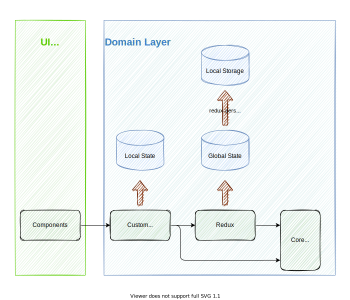

# ARCHITECTURE

## Component, Logic and State Dependency Flow

<!--
  [How to Modify following svg file]
    1) open draw.io.
    2) import this svg file
    3) modify
    4) export as svg file
-->


## ER of core model

`/src/core` has model data and ER is like below.


```
/src
|- /core
| |- /calendar
| |- /story
| |- /resource
| |- /event
```

## Deps graph

TODO: inplement in CI and automatically save this doc in /doc dir

```zsh
# Build dot file
$ yarn graph:dot

# Build svg file from dot file
$ brwe install graphviz # prerequirements
$ yarn graph:svg
```

## Atomic Design

Plangoab is following [Atomic Design](https://bradfrost.com/blog/post/atomic-web-design/) at `/src/components/*`

## No Class, But Function

On Model Layer, Plangoab is implemented without using Class at `/src/core/*`.

There is no class but only plain JavaScript objects and functions.
On the otherhands, we need a strictly implicit rule about how to handle a model.
We must not handle a model without function of this model layer.
If not, I assume the code would become easily getting chaos because data would be changed everywhere.

## State Management

Plangoab is using Redux for global state at `/src/redux/*`.

Redux is a global state management library. Plangoab handles a complicated structure of data because of having calendar features. Additionally, there is no back-end so we need handle data in only front-end somehow. That is why Plangoab is choosing Redux instead of Context API.

Context API can easily handle a global state but trade-off is that logic become getting complicated easily as well. On this trade-off and background, Plangoab has to need Redux and We choose NOT to use Context API.

## Local Cache Management

Plangoab is using local storage with `redux-persist`.

That's why we have to pay attention when to change a shape of redux data.
Now that `redux-persist` has `version` config so we care it when to upgrade a shape.

## Hosting

Hosting = Netlify + Github Pages

- Name Server is `Netlify`
- Web Server is `GitHub Pages`

Config Files

- `/public/_redirects`: File which Netlify will read in order to force config to redirect http to https.
- `/public/CNAME`: File that which GitHub Pages will read in order to configure a custom domain.
